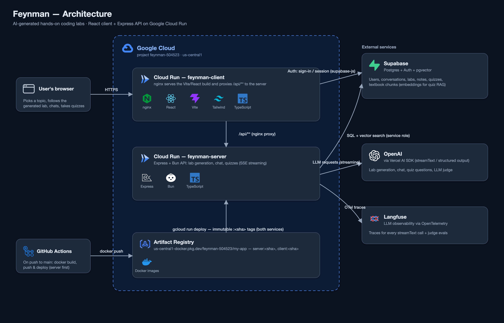

# Feynman

Pick a software or coding topic and get a step-by-step, hands-on lab generated by an
LLM and tailored to your skill level. Chat with a tutor alongside the lab, take notes
automatically, and finish with a quiz grounded in real textbook content.

## Features

- **Lab generation** — streams a structured lab (title + steps, optional shell code
  and starter code) for any CS/software topic, cached by `(topic, skill level)`.
- **Chat tutor** — conversation scoped to CS/software topics, with optional
  fire-and-forget note extraction.
- **Quizzes** — RAG over ingested textbooks (pgvector similarity search); generated
  questions are structurally validated, and a sampled fraction of answer keys is
  double-checked by a second LLM judge pass.
- **Observability** — every LLM call is traced end-to-end with Langfuse via
  OpenTelemetry.

## Architecture



- **Client** (`packages/client`) — React + Tailwind + shadcn/ui (Vite). Served by
  nginx on Cloud Run, which also proxies `/api/**` to the server.
- **Server** (`packages/server`) — Express + TypeScript on Bun, layered
  controller → service → repository. Services stream typed SSE events to the client.
- **Supabase** — Postgres (labs, conversations, notes, quizzes, textbook chunks),
  Auth (Bearer tokens validated by server middleware), pgvector for quiz RAG.
- **OpenAI** (via Vercel AI SDK) — lab/chat/quiz generation and the quiz judge.
- **Langfuse** — LLM tracing, wired through an OpenTelemetry `NodeSDK`.

### Deployment

Everything runs in Google Cloud (`us-central1`). On every push to `main`, GitHub
Actions builds the server and client Docker images, pushes them to **Artifact
Registry** (`us-central1-docker.pkg.dev/feynman-504523/my-app`), and deploys them by
immutable commit-SHA tag to two **Cloud Run** services — `feynman-server` first, then
`feynman-client`, so the API is never older than the frontend calling it.

## Repository layout

```
packages/
  client/   # Vite + React app (Dockerfile: nginx serving the build)
  server/   # Express + Bun API (controllers/, services/, repositories/)
docs/       # architecture diagram
```

## Getting started

```bash
# server (packages/server)
bun install
bun run dev          # bun --watch run index.ts

# client (packages/client)
bun install
bun run dev          # vite dev server
bun run build        # tsc -b && vite build
bun run lint
```

The server reads its config (`OPENAI_API_KEY`, `SUPABASE_*`, `LANGFUSE_*`) from
`.env`, which Bun loads automatically. Textbooks for the quiz corpus are ingested
offline with `packages/server/scripts/ingestTextbooks.ts`.
